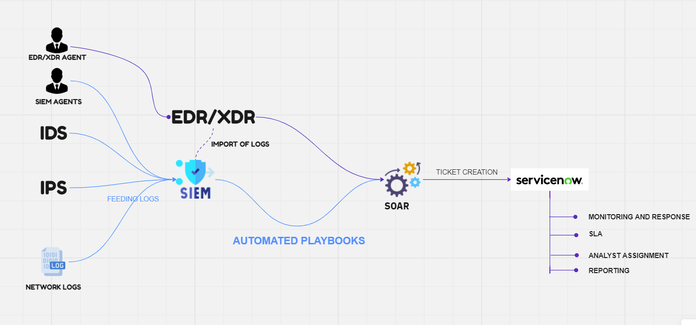

# SOC-Architecture-and-Engineering-Personal-Project

## Introduction
This is a personal project. My aim is to use limited resource such as zero to minimal cost of establish an SOC Project.
The market is full of open-source tools that is very powerful to use specially for organization that is starting to establish 
their SOC process.

## How to navigate this repository. 
The structure of this repo revolve arround the below. (Note this is my first attempt on arhitecture side of things) 


### Folder Structure
```
- root-folder
  |__ docs
  |   |__ imgs
  |   |   |__ image1.jpg
  |   |   |__ image2.png
  |   |__ README.md
  |   |__ automation.md
  |   |__ siem.md
  |   |__ log-imports.md
  |   |__ mock-data.md
  |
  |__ mock-data
  |__ siem
  |__ src
      |__ lambda-functions
      |__ powershell_scripts
      
  |__ other_directories_and_files

```